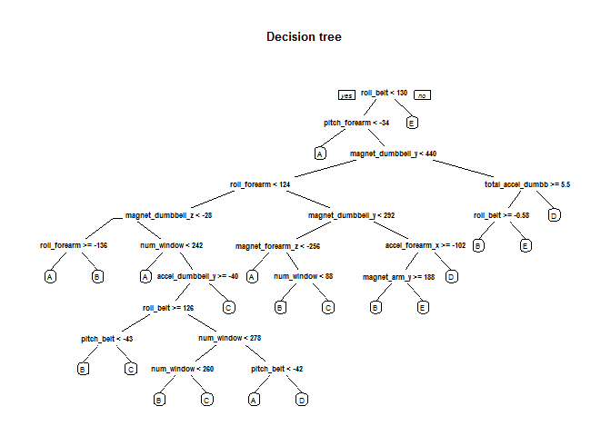

# Machine Learning - Project
Alessandro  
Sunday, June 21, 2015  

###Background

Using devices such as Jawbone Up, Nike FuelBand, and Fitbit it is now possible to collect a large amount of data about personal activity relatively inexpensively. These type of devices are part of the quantified self movement - a group of enthusiasts who take measurements about themselves regularly to improve their health, to find patterns in their behavior, or because they are tech geeks. One thing that people regularly do is quantify how much of a particular activity they do, but they rarely quantify how well they do it. In this project, your goal will be to use data from accelerometers on the belt, forearm, arm, and dumbell of 6 participants. They were asked to perform barbell lifts correctly and incorrectly in 5 different ways. More information is available from the website here: <http://groupware.les.inf.puc-rio.br/har> (see the section on the Weight Lifting Exercise Dataset). 


###Data 


The training data for this project are available here: 

<https://d396qusza40orc.cloudfront.net/predmachlearn/pml-training.csv>

The test data are available here: 

<https://d396qusza40orc.cloudfront.net/predmachlearn/pml-testing.csv>

The data for this project come from this source: http://groupware.les.inf.puc-rio.br/har. If you use the document you create for this class for any purpose please cite them as they have been very generous in allowing their data to be used for this kind of assignment. 

###Method
The  variable is classe. For this data set, "participants were asked to perform one set of 10 repetitions of the Unilateral Dumbbell Biceps Curl in 5 different fashions: - exactly according to the specification (Class A) - throwing the elbows to the front (Class B) - lifting the dumbbell only halfway (Class C) - lowering the dumbbell only halfway (Class D) - throwing the hips to the front (Class E)

Two models will be tested using decision tree and random forest. The model with the highest accuracy will be chosen as our final model.


```r
library(ggplot2)
library(caret)
```

```
## Warning: package 'caret' was built under R version 3.1.3
```

```
## Loading required package: lattice
```

```r
library(parallel)
library(doParallel)
```

```
## Warning: package 'doParallel' was built under R version 3.1.3
```

```
## Loading required package: foreach
```

```
## Warning: package 'foreach' was built under R version 3.1.3
```

```
## Loading required package: iterators
```

```
## Warning: package 'iterators' was built under R version 3.1.3
```

```r
library(rpart)
```

```
## Warning: package 'rpart' was built under R version 3.1.3
```

```r
library(rpart.plot)
```

```
## Warning: package 'rpart.plot' was built under R version 3.1.3
```

```r
library(data.table)
library(class)
```

```
## Warning: package 'class' was built under R version 3.1.3
```

```r
library(randomForest)
```

```
## Warning: package 'randomForest' was built under R version 3.1.3
```

```
## randomForest 4.6-10
## Type rfNews() to see new features/changes/bug fixes.
```

```r
library(tm)
```

```
## Warning: package 'tm' was built under R version 3.1.3
```

```
## Loading required package: NLP
```

```
## Warning: package 'NLP' was built under R version 3.1.3
```

```
## 
## Attaching package: 'NLP'
## 
## The following object is masked from 'package:ggplot2':
## 
##     annotate
```

```r
#load training dataset into memory

data_set_training<- read.csv("pml-training.csv")
#load testing dataset into memory
data_set_testing<- read.csv("pml-testing.csv")
#select the colums present in both training and testing dataset
names(data_set_training)
```

```
##   [1] "X"                        "user_name"               
##   [3] "raw_timestamp_part_1"     "raw_timestamp_part_2"    
##   [5] "cvtd_timestamp"           "new_window"              
##   [7] "num_window"               "roll_belt"               
##   [9] "pitch_belt"               "yaw_belt"                
##  [11] "total_accel_belt"         "kurtosis_roll_belt"      
##  [13] "kurtosis_picth_belt"      "kurtosis_yaw_belt"       
##  [15] "skewness_roll_belt"       "skewness_roll_belt.1"    
##  [17] "skewness_yaw_belt"        "max_roll_belt"           
##  [19] "max_picth_belt"           "max_yaw_belt"            
##  [21] "min_roll_belt"            "min_pitch_belt"          
##  [23] "min_yaw_belt"             "amplitude_roll_belt"     
##  [25] "amplitude_pitch_belt"     "amplitude_yaw_belt"      
##  [27] "var_total_accel_belt"     "avg_roll_belt"           
##  [29] "stddev_roll_belt"         "var_roll_belt"           
##  [31] "avg_pitch_belt"           "stddev_pitch_belt"       
##  [33] "var_pitch_belt"           "avg_yaw_belt"            
##  [35] "stddev_yaw_belt"          "var_yaw_belt"            
##  [37] "gyros_belt_x"             "gyros_belt_y"            
##  [39] "gyros_belt_z"             "accel_belt_x"            
##  [41] "accel_belt_y"             "accel_belt_z"            
##  [43] "magnet_belt_x"            "magnet_belt_y"           
##  [45] "magnet_belt_z"            "roll_arm"                
##  [47] "pitch_arm"                "yaw_arm"                 
##  [49] "total_accel_arm"          "var_accel_arm"           
##  [51] "avg_roll_arm"             "stddev_roll_arm"         
##  [53] "var_roll_arm"             "avg_pitch_arm"           
##  [55] "stddev_pitch_arm"         "var_pitch_arm"           
##  [57] "avg_yaw_arm"              "stddev_yaw_arm"          
##  [59] "var_yaw_arm"              "gyros_arm_x"             
##  [61] "gyros_arm_y"              "gyros_arm_z"             
##  [63] "accel_arm_x"              "accel_arm_y"             
##  [65] "accel_arm_z"              "magnet_arm_x"            
##  [67] "magnet_arm_y"             "magnet_arm_z"            
##  [69] "kurtosis_roll_arm"        "kurtosis_picth_arm"      
##  [71] "kurtosis_yaw_arm"         "skewness_roll_arm"       
##  [73] "skewness_pitch_arm"       "skewness_yaw_arm"        
##  [75] "max_roll_arm"             "max_picth_arm"           
##  [77] "max_yaw_arm"              "min_roll_arm"            
##  [79] "min_pitch_arm"            "min_yaw_arm"             
##  [81] "amplitude_roll_arm"       "amplitude_pitch_arm"     
##  [83] "amplitude_yaw_arm"        "roll_dumbbell"           
##  [85] "pitch_dumbbell"           "yaw_dumbbell"            
##  [87] "kurtosis_roll_dumbbell"   "kurtosis_picth_dumbbell" 
##  [89] "kurtosis_yaw_dumbbell"    "skewness_roll_dumbbell"  
##  [91] "skewness_pitch_dumbbell"  "skewness_yaw_dumbbell"   
##  [93] "max_roll_dumbbell"        "max_picth_dumbbell"      
##  [95] "max_yaw_dumbbell"         "min_roll_dumbbell"       
##  [97] "min_pitch_dumbbell"       "min_yaw_dumbbell"        
##  [99] "amplitude_roll_dumbbell"  "amplitude_pitch_dumbbell"
## [101] "amplitude_yaw_dumbbell"   "total_accel_dumbbell"    
## [103] "var_accel_dumbbell"       "avg_roll_dumbbell"       
## [105] "stddev_roll_dumbbell"     "var_roll_dumbbell"       
## [107] "avg_pitch_dumbbell"       "stddev_pitch_dumbbell"   
## [109] "var_pitch_dumbbell"       "avg_yaw_dumbbell"        
## [111] "stddev_yaw_dumbbell"      "var_yaw_dumbbell"        
## [113] "gyros_dumbbell_x"         "gyros_dumbbell_y"        
## [115] "gyros_dumbbell_z"         "accel_dumbbell_x"        
## [117] "accel_dumbbell_y"         "accel_dumbbell_z"        
## [119] "magnet_dumbbell_x"        "magnet_dumbbell_y"       
## [121] "magnet_dumbbell_z"        "roll_forearm"            
## [123] "pitch_forearm"            "yaw_forearm"             
## [125] "kurtosis_roll_forearm"    "kurtosis_picth_forearm"  
## [127] "kurtosis_yaw_forearm"     "skewness_roll_forearm"   
## [129] "skewness_pitch_forearm"   "skewness_yaw_forearm"    
## [131] "max_roll_forearm"         "max_picth_forearm"       
## [133] "max_yaw_forearm"          "min_roll_forearm"        
## [135] "min_pitch_forearm"        "min_yaw_forearm"         
## [137] "amplitude_roll_forearm"   "amplitude_pitch_forearm" 
## [139] "amplitude_yaw_forearm"    "total_accel_forearm"     
## [141] "var_accel_forearm"        "avg_roll_forearm"        
## [143] "stddev_roll_forearm"      "var_roll_forearm"        
## [145] "avg_pitch_forearm"        "stddev_pitch_forearm"    
## [147] "var_pitch_forearm"        "avg_yaw_forearm"         
## [149] "stddev_yaw_forearm"       "var_yaw_forearm"         
## [151] "gyros_forearm_x"          "gyros_forearm_y"         
## [153] "gyros_forearm_z"          "accel_forearm_x"         
## [155] "accel_forearm_y"          "accel_forearm_z"         
## [157] "magnet_forearm_x"         "magnet_forearm_y"        
## [159] "magnet_forearm_z"         "classe"
```

```r
names(data_set_testing)
```

```
##   [1] "X"                        "user_name"               
##   [3] "raw_timestamp_part_1"     "raw_timestamp_part_2"    
##   [5] "cvtd_timestamp"           "new_window"              
##   [7] "num_window"               "roll_belt"               
##   [9] "pitch_belt"               "yaw_belt"                
##  [11] "total_accel_belt"         "kurtosis_roll_belt"      
##  [13] "kurtosis_picth_belt"      "kurtosis_yaw_belt"       
##  [15] "skewness_roll_belt"       "skewness_roll_belt.1"    
##  [17] "skewness_yaw_belt"        "max_roll_belt"           
##  [19] "max_picth_belt"           "max_yaw_belt"            
##  [21] "min_roll_belt"            "min_pitch_belt"          
##  [23] "min_yaw_belt"             "amplitude_roll_belt"     
##  [25] "amplitude_pitch_belt"     "amplitude_yaw_belt"      
##  [27] "var_total_accel_belt"     "avg_roll_belt"           
##  [29] "stddev_roll_belt"         "var_roll_belt"           
##  [31] "avg_pitch_belt"           "stddev_pitch_belt"       
##  [33] "var_pitch_belt"           "avg_yaw_belt"            
##  [35] "stddev_yaw_belt"          "var_yaw_belt"            
##  [37] "gyros_belt_x"             "gyros_belt_y"            
##  [39] "gyros_belt_z"             "accel_belt_x"            
##  [41] "accel_belt_y"             "accel_belt_z"            
##  [43] "magnet_belt_x"            "magnet_belt_y"           
##  [45] "magnet_belt_z"            "roll_arm"                
##  [47] "pitch_arm"                "yaw_arm"                 
##  [49] "total_accel_arm"          "var_accel_arm"           
##  [51] "avg_roll_arm"             "stddev_roll_arm"         
##  [53] "var_roll_arm"             "avg_pitch_arm"           
##  [55] "stddev_pitch_arm"         "var_pitch_arm"           
##  [57] "avg_yaw_arm"              "stddev_yaw_arm"          
##  [59] "var_yaw_arm"              "gyros_arm_x"             
##  [61] "gyros_arm_y"              "gyros_arm_z"             
##  [63] "accel_arm_x"              "accel_arm_y"             
##  [65] "accel_arm_z"              "magnet_arm_x"            
##  [67] "magnet_arm_y"             "magnet_arm_z"            
##  [69] "kurtosis_roll_arm"        "kurtosis_picth_arm"      
##  [71] "kurtosis_yaw_arm"         "skewness_roll_arm"       
##  [73] "skewness_pitch_arm"       "skewness_yaw_arm"        
##  [75] "max_roll_arm"             "max_picth_arm"           
##  [77] "max_yaw_arm"              "min_roll_arm"            
##  [79] "min_pitch_arm"            "min_yaw_arm"             
##  [81] "amplitude_roll_arm"       "amplitude_pitch_arm"     
##  [83] "amplitude_yaw_arm"        "roll_dumbbell"           
##  [85] "pitch_dumbbell"           "yaw_dumbbell"            
##  [87] "kurtosis_roll_dumbbell"   "kurtosis_picth_dumbbell" 
##  [89] "kurtosis_yaw_dumbbell"    "skewness_roll_dumbbell"  
##  [91] "skewness_pitch_dumbbell"  "skewness_yaw_dumbbell"   
##  [93] "max_roll_dumbbell"        "max_picth_dumbbell"      
##  [95] "max_yaw_dumbbell"         "min_roll_dumbbell"       
##  [97] "min_pitch_dumbbell"       "min_yaw_dumbbell"        
##  [99] "amplitude_roll_dumbbell"  "amplitude_pitch_dumbbell"
## [101] "amplitude_yaw_dumbbell"   "total_accel_dumbbell"    
## [103] "var_accel_dumbbell"       "avg_roll_dumbbell"       
## [105] "stddev_roll_dumbbell"     "var_roll_dumbbell"       
## [107] "avg_pitch_dumbbell"       "stddev_pitch_dumbbell"   
## [109] "var_pitch_dumbbell"       "avg_yaw_dumbbell"        
## [111] "stddev_yaw_dumbbell"      "var_yaw_dumbbell"        
## [113] "gyros_dumbbell_x"         "gyros_dumbbell_y"        
## [115] "gyros_dumbbell_z"         "accel_dumbbell_x"        
## [117] "accel_dumbbell_y"         "accel_dumbbell_z"        
## [119] "magnet_dumbbell_x"        "magnet_dumbbell_y"       
## [121] "magnet_dumbbell_z"        "roll_forearm"            
## [123] "pitch_forearm"            "yaw_forearm"             
## [125] "kurtosis_roll_forearm"    "kurtosis_picth_forearm"  
## [127] "kurtosis_yaw_forearm"     "skewness_roll_forearm"   
## [129] "skewness_pitch_forearm"   "skewness_yaw_forearm"    
## [131] "max_roll_forearm"         "max_picth_forearm"       
## [133] "max_yaw_forearm"          "min_roll_forearm"        
## [135] "min_pitch_forearm"        "min_yaw_forearm"         
## [137] "amplitude_roll_forearm"   "amplitude_pitch_forearm" 
## [139] "amplitude_yaw_forearm"    "total_accel_forearm"     
## [141] "var_accel_forearm"        "avg_roll_forearm"        
## [143] "stddev_roll_forearm"      "var_roll_forearm"        
## [145] "avg_pitch_forearm"        "stddev_pitch_forearm"    
## [147] "var_pitch_forearm"        "avg_yaw_forearm"         
## [149] "stddev_yaw_forearm"       "var_yaw_forearm"         
## [151] "gyros_forearm_x"          "gyros_forearm_y"         
## [153] "gyros_forearm_z"          "accel_forearm_x"         
## [155] "accel_forearm_y"          "accel_forearm_z"         
## [157] "magnet_forearm_x"         "magnet_forearm_y"        
## [159] "magnet_forearm_z"         "problem_id"
```

```r
data_set_training <- data_set_training[c("user_name", "new_window", "num_window", "roll_belt", "pitch_belt", "yaw_belt",        
                     "total_accel_belt", "gyros_belt_x", "gyros_belt_y", "gyros_belt_z", "accel_belt_x",   
                     "accel_belt_y", "accel_belt_z", "magnet_belt_x", "magnet_belt_y", "magnet_belt_z",    
                     "roll_arm", "pitch_arm", "yaw_arm", "total_accel_arm", "gyros_arm_x", "gyros_arm_y",  
                     "gyros_arm_z", "accel_arm_x", "accel_arm_y", "accel_arm_z", "magnet_arm_x",   
                     "magnet_arm_y", "magnet_arm_z", "roll_dumbbell", "pitch_dumbbell", "yaw_dumbbell",
                     "total_accel_dumbbell", "gyros_dumbbell_x", "gyros_dumbbell_y", "gyros_dumbbell_z",   
                     "accel_dumbbell_x", "accel_dumbbell_y", "accel_dumbbell_z", "magnet_dumbbell_x",  
                     "magnet_dumbbell_y", "magnet_dumbbell_z", "roll_forearm", "pitch_forearm", "yaw_forearm",
                     "total_accel_forearm", "gyros_forearm_x", "gyros_forearm_y", "gyros_forearm_z", "accel_forearm_x",    
                     "accel_forearm_y", "accel_forearm_z", "magnet_forearm_x", "magnet_forearm_y", "magnet_forearm_z", "classe")]
```


Before to start with the machine learning analisys i work on training dataset in order to evaluate the how the dataset in make and the value of "classe" variable and the percentage of split 


```r
str(data_set_testing)
```

```
## 'data.frame':	20 obs. of  160 variables:
##  $ X                       : int  1 2 3 4 5 6 7 8 9 10 ...
##  $ user_name               : Factor w/ 6 levels "adelmo","carlitos",..: 6 5 5 1 4 5 5 5 2 3 ...
##  $ raw_timestamp_part_1    : int  1323095002 1322673067 1322673075 1322832789 1322489635 1322673149 1322673128 1322673076 1323084240 1322837822 ...
##  $ raw_timestamp_part_2    : int  868349 778725 342967 560311 814776 510661 766645 54671 916313 384285 ...
##  $ cvtd_timestamp          : Factor w/ 11 levels "02/12/2011 13:33",..: 5 10 10 1 6 11 11 10 3 2 ...
##  $ new_window              : Factor w/ 1 level "no": 1 1 1 1 1 1 1 1 1 1 ...
##  $ num_window              : int  74 431 439 194 235 504 485 440 323 664 ...
##  $ roll_belt               : num  123 1.02 0.87 125 1.35 -5.92 1.2 0.43 0.93 114 ...
##  $ pitch_belt              : num  27 4.87 1.82 -41.6 3.33 1.59 4.44 4.15 6.72 22.4 ...
##  $ yaw_belt                : num  -4.75 -88.9 -88.5 162 -88.6 -87.7 -87.3 -88.5 -93.7 -13.1 ...
##  $ total_accel_belt        : int  20 4 5 17 3 4 4 4 4 18 ...
##  $ kurtosis_roll_belt      : logi  NA NA NA NA NA NA ...
##  $ kurtosis_picth_belt     : logi  NA NA NA NA NA NA ...
##  $ kurtosis_yaw_belt       : logi  NA NA NA NA NA NA ...
##  $ skewness_roll_belt      : logi  NA NA NA NA NA NA ...
##  $ skewness_roll_belt.1    : logi  NA NA NA NA NA NA ...
##  $ skewness_yaw_belt       : logi  NA NA NA NA NA NA ...
##  $ max_roll_belt           : logi  NA NA NA NA NA NA ...
##  $ max_picth_belt          : logi  NA NA NA NA NA NA ...
##  $ max_yaw_belt            : logi  NA NA NA NA NA NA ...
##  $ min_roll_belt           : logi  NA NA NA NA NA NA ...
##  $ min_pitch_belt          : logi  NA NA NA NA NA NA ...
##  $ min_yaw_belt            : logi  NA NA NA NA NA NA ...
##  $ amplitude_roll_belt     : logi  NA NA NA NA NA NA ...
##  $ amplitude_pitch_belt    : logi  NA NA NA NA NA NA ...
##  $ amplitude_yaw_belt      : logi  NA NA NA NA NA NA ...
##  $ var_total_accel_belt    : logi  NA NA NA NA NA NA ...
##  $ avg_roll_belt           : logi  NA NA NA NA NA NA ...
##  $ stddev_roll_belt        : logi  NA NA NA NA NA NA ...
##  $ var_roll_belt           : logi  NA NA NA NA NA NA ...
##  $ avg_pitch_belt          : logi  NA NA NA NA NA NA ...
##  $ stddev_pitch_belt       : logi  NA NA NA NA NA NA ...
##  $ var_pitch_belt          : logi  NA NA NA NA NA NA ...
##  $ avg_yaw_belt            : logi  NA NA NA NA NA NA ...
##  $ stddev_yaw_belt         : logi  NA NA NA NA NA NA ...
##  $ var_yaw_belt            : logi  NA NA NA NA NA NA ...
##  $ gyros_belt_x            : num  -0.5 -0.06 0.05 0.11 0.03 0.1 -0.06 -0.18 0.1 0.14 ...
##  $ gyros_belt_y            : num  -0.02 -0.02 0.02 0.11 0.02 0.05 0 -0.02 0 0.11 ...
##  $ gyros_belt_z            : num  -0.46 -0.07 0.03 -0.16 0 -0.13 0 -0.03 -0.02 -0.16 ...
##  $ accel_belt_x            : int  -38 -13 1 46 -8 -11 -14 -10 -15 -25 ...
##  $ accel_belt_y            : int  69 11 -1 45 4 -16 2 -2 1 63 ...
##  $ accel_belt_z            : int  -179 39 49 -156 27 38 35 42 32 -158 ...
##  $ magnet_belt_x           : int  -13 43 29 169 33 31 50 39 -6 10 ...
##  $ magnet_belt_y           : int  581 636 631 608 566 638 622 635 600 601 ...
##  $ magnet_belt_z           : int  -382 -309 -312 -304 -418 -291 -315 -305 -302 -330 ...
##  $ roll_arm                : num  40.7 0 0 -109 76.1 0 0 0 -137 -82.4 ...
##  $ pitch_arm               : num  -27.8 0 0 55 2.76 0 0 0 11.2 -63.8 ...
##  $ yaw_arm                 : num  178 0 0 -142 102 0 0 0 -167 -75.3 ...
##  $ total_accel_arm         : int  10 38 44 25 29 14 15 22 34 32 ...
##  $ var_accel_arm           : logi  NA NA NA NA NA NA ...
##  $ avg_roll_arm            : logi  NA NA NA NA NA NA ...
##  $ stddev_roll_arm         : logi  NA NA NA NA NA NA ...
##  $ var_roll_arm            : logi  NA NA NA NA NA NA ...
##  $ avg_pitch_arm           : logi  NA NA NA NA NA NA ...
##  $ stddev_pitch_arm        : logi  NA NA NA NA NA NA ...
##  $ var_pitch_arm           : logi  NA NA NA NA NA NA ...
##  $ avg_yaw_arm             : logi  NA NA NA NA NA NA ...
##  $ stddev_yaw_arm          : logi  NA NA NA NA NA NA ...
##  $ var_yaw_arm             : logi  NA NA NA NA NA NA ...
##  $ gyros_arm_x             : num  -1.65 -1.17 2.1 0.22 -1.96 0.02 2.36 -3.71 0.03 0.26 ...
##  $ gyros_arm_y             : num  0.48 0.85 -1.36 -0.51 0.79 0.05 -1.01 1.85 -0.02 -0.5 ...
##  $ gyros_arm_z             : num  -0.18 -0.43 1.13 0.92 -0.54 -0.07 0.89 -0.69 -0.02 0.79 ...
##  $ accel_arm_x             : int  16 -290 -341 -238 -197 -26 99 -98 -287 -301 ...
##  $ accel_arm_y             : int  38 215 245 -57 200 130 79 175 111 -42 ...
##  $ accel_arm_z             : int  93 -90 -87 6 -30 -19 -67 -78 -122 -80 ...
##  $ magnet_arm_x            : int  -326 -325 -264 -173 -170 396 702 535 -367 -420 ...
##  $ magnet_arm_y            : int  385 447 474 257 275 176 15 215 335 294 ...
##  $ magnet_arm_z            : int  481 434 413 633 617 516 217 385 520 493 ...
##  $ kurtosis_roll_arm       : logi  NA NA NA NA NA NA ...
##  $ kurtosis_picth_arm      : logi  NA NA NA NA NA NA ...
##  $ kurtosis_yaw_arm        : logi  NA NA NA NA NA NA ...
##  $ skewness_roll_arm       : logi  NA NA NA NA NA NA ...
##  $ skewness_pitch_arm      : logi  NA NA NA NA NA NA ...
##  $ skewness_yaw_arm        : logi  NA NA NA NA NA NA ...
##  $ max_roll_arm            : logi  NA NA NA NA NA NA ...
##  $ max_picth_arm           : logi  NA NA NA NA NA NA ...
##  $ max_yaw_arm             : logi  NA NA NA NA NA NA ...
##  $ min_roll_arm            : logi  NA NA NA NA NA NA ...
##  $ min_pitch_arm           : logi  NA NA NA NA NA NA ...
##  $ min_yaw_arm             : logi  NA NA NA NA NA NA ...
##  $ amplitude_roll_arm      : logi  NA NA NA NA NA NA ...
##  $ amplitude_pitch_arm     : logi  NA NA NA NA NA NA ...
##  $ amplitude_yaw_arm       : logi  NA NA NA NA NA NA ...
##  $ roll_dumbbell           : num  -17.7 54.5 57.1 43.1 -101.4 ...
##  $ pitch_dumbbell          : num  25 -53.7 -51.4 -30 -53.4 ...
##  $ yaw_dumbbell            : num  126.2 -75.5 -75.2 -103.3 -14.2 ...
##  $ kurtosis_roll_dumbbell  : logi  NA NA NA NA NA NA ...
##  $ kurtosis_picth_dumbbell : logi  NA NA NA NA NA NA ...
##  $ kurtosis_yaw_dumbbell   : logi  NA NA NA NA NA NA ...
##  $ skewness_roll_dumbbell  : logi  NA NA NA NA NA NA ...
##  $ skewness_pitch_dumbbell : logi  NA NA NA NA NA NA ...
##  $ skewness_yaw_dumbbell   : logi  NA NA NA NA NA NA ...
##  $ max_roll_dumbbell       : logi  NA NA NA NA NA NA ...
##  $ max_picth_dumbbell      : logi  NA NA NA NA NA NA ...
##  $ max_yaw_dumbbell        : logi  NA NA NA NA NA NA ...
##  $ min_roll_dumbbell       : logi  NA NA NA NA NA NA ...
##  $ min_pitch_dumbbell      : logi  NA NA NA NA NA NA ...
##  $ min_yaw_dumbbell        : logi  NA NA NA NA NA NA ...
##  $ amplitude_roll_dumbbell : logi  NA NA NA NA NA NA ...
##   [list output truncated]
```

```r
summary(data_set_training$classe)
```

```
##    A    B    C    D    E 
## 5580 3797 3422 3216 3607
```

```r
#Dimension of row
dim(data_set_training)
```

```
## [1] 19622    56
```

```r
table(data_set_training$classe)
```

```
## 
##    A    B    C    D    E 
## 5580 3797 3422 3216 3607
```

```r
#convert into factor
data_set_training$classe<-factor(data_set_training$classe,levels=c("A","B","C","D","E"),labels=c("A","B","C","D","E"))

#percentage of split into classe variable
round(prop.table(table(data_set_training$classe))*100,digits=1)
```

```
## 
##    A    B    C    D    E 
## 28.4 19.4 17.4 16.4 18.4
```

###Random Partitioning dataset Training 

#Cross-validation

Cross-validation will be performed by subsampling our training data set randomly without replacement into 2 subsamples: training data (75% of the original Training data set) and other Training. the most accurate model is choosen.


```r
#Set Random Seed with 19622 random value
set.seed(4905)
##Create a random partitioning using the caret package
inTrain = createDataPartition(data_set_training$classe, p = 3/4)[[1]]
## create a training dataset with 75% random data from the original dataset to build a suitable model
training <- data_set_training[inTrain,]
## Create a testing dataset with 25% random data from the original dataset to test the model
testing <- data_set_training[-inTrain,]
```


###Tree prediction module
Evaluate the prediction method tree and test the result with Confusion Matrix


```r
#use Rpart to recursive partitioning and regression trees on training set
class_training<-rpart(classe ~ .,data=training,method="class" )
#Rpart.plot to plot the decision tree
rpart.plot(class_training,main="Decision tree",digits=2)
```

 

```r
#use model prediction to predict from the result of rpart and fit the model
tree_training<-predict(class_training,testing,type="class")

#Use COnfusion matrix to summary of prediction result
confusionMatrix(tree_training,testing$classe)
```

```
## Confusion Matrix and Statistics
## 
##           Reference
## Prediction    A    B    C    D    E
##          A 1231  158   25   57   54
##          B   44  564   57   85  120
##          C   17   70  698  105   84
##          D   82  126   48  530  107
##          E   21   31   27   27  536
## 
## Overall Statistics
##                                          
##                Accuracy : 0.7257         
##                  95% CI : (0.713, 0.7382)
##     No Information Rate : 0.2845         
##     P-Value [Acc > NIR] : < 2.2e-16      
##                                          
##                   Kappa : 0.6522         
##  Mcnemar's Test P-Value : < 2.2e-16      
## 
## Statistics by Class:
## 
##                      Class: A Class: B Class: C Class: D Class: E
## Sensitivity            0.8824   0.5943   0.8164   0.6592   0.5949
## Specificity            0.9162   0.9226   0.9318   0.9115   0.9735
## Pos Pred Value         0.8072   0.6483   0.7166   0.5935   0.8349
## Neg Pred Value         0.9515   0.9046   0.9601   0.9317   0.9144
## Prevalence             0.2845   0.1935   0.1743   0.1639   0.1837
## Detection Rate         0.2510   0.1150   0.1423   0.1081   0.1093
## Detection Prevalence   0.3110   0.1774   0.1986   0.1821   0.1309
## Balanced Accuracy      0.8993   0.7585   0.8741   0.7853   0.7842
```

# Random Forest model
Use another model (Random Forest) to fit the data with this model.BEfore to start for long analisy i enable the cluster of core in order to reduce the time of analisys.


```r
#analize the core installed and make the cluster
cl <- makeCluster(detectCores() - 2)
registerDoParallel(cl, cores = detectCores() - 2)

#Random forest algoritm
p_training<-randomForest(classe ~ .,data=training)
#Prediction on testing value
rf_predict<-predict(p_training,testing,type="class")
#Result of testing data set
confusionMatrix(rf_predict,testing$classe)
```

```
## Confusion Matrix and Statistics
## 
##           Reference
## Prediction    A    B    C    D    E
##          A 1395    0    0    0    0
##          B    0  949    2    0    0
##          C    0    0  853    1    0
##          D    0    0    0  803    1
##          E    0    0    0    0  900
## 
## Overall Statistics
##                                           
##                Accuracy : 0.9992          
##                  95% CI : (0.9979, 0.9998)
##     No Information Rate : 0.2845          
##     P-Value [Acc > NIR] : < 2.2e-16       
##                                           
##                   Kappa : 0.999           
##  Mcnemar's Test P-Value : NA              
## 
## Statistics by Class:
## 
##                      Class: A Class: B Class: C Class: D Class: E
## Sensitivity            1.0000   1.0000   0.9977   0.9988   0.9989
## Specificity            1.0000   0.9995   0.9998   0.9998   1.0000
## Pos Pred Value         1.0000   0.9979   0.9988   0.9988   1.0000
## Neg Pred Value         1.0000   1.0000   0.9995   0.9998   0.9998
## Prevalence             0.2845   0.1935   0.1743   0.1639   0.1837
## Detection Rate         0.2845   0.1935   0.1739   0.1637   0.1835
## Detection Prevalence   0.2845   0.1939   0.1741   0.1639   0.1835
## Balanced Accuracy      1.0000   0.9997   0.9987   0.9993   0.9994
```


###Model fitting
the Decision Trees is not better that Random Forest. Accuracy for Random Forest model was 0.9992 (95% CI: (0.9979, 0.9998)) compared to Decision Tree model with 0.726 (95% CI: (0.713, 0.738)). The Random Forests model is best to apply. The expected out-of-sample error is estimated at 0.0007


